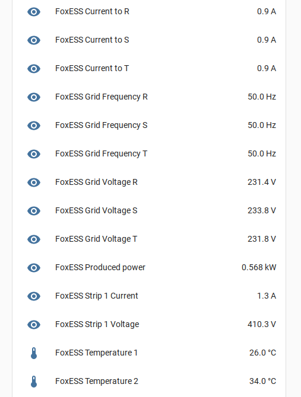
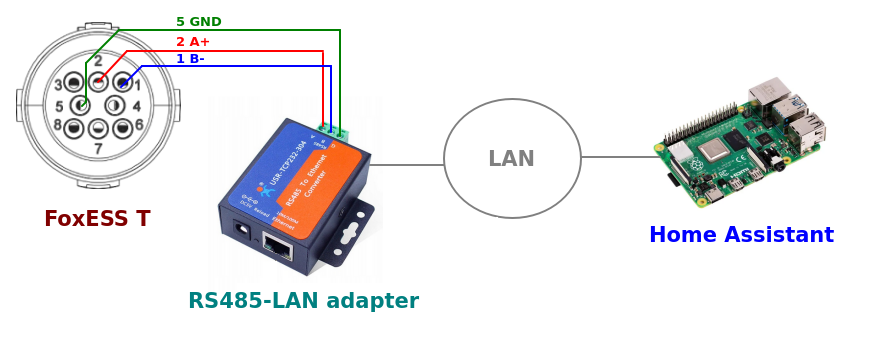

# FoxESS T series readnig via Modbus

Home Assistant integration with FoxESS T series via Modbus TCP. Features:

* local integration without cloud access
* high data rates possible (interval of a few seconds)
* communication via LAN or WiFi
* supported parameters
  * currently produced power
  * PV voltage and current
  * grid voltage, frequency and current from the inverter for each phase
  * temperature

The goal is generally same as in https://github.com/assembly12/Foxess-T-series-ESPHome-Home-Assistant but we use a stock RS485-to-LAN or RS485-to-WiFi adapter instead of a custom ESP8266-based device

## Installation
1. Connect your TCP485-to-LAN or TCP485-to-WiFi converter. See [Adapter connection](#adapter-connection) section below for details and [this list](adapters/README.md) for tested adapters. 
2. Ensure your FoxESS inverter is set to `Comm` in `Settings` -> `CT/Meter` (if this setting is not available, you need to contact the FoxESS service to upgrade the firmware). 
2. Configure the adapter. See [this](adapters/README.md) for examples known to work.
3. Copy [config/packages/foxess.yaml](config/packages/foxess.yaml) to your Home Assistant `config/packages` directory **and tune it to your needs**.
   * Note: ensure you have `packages: !include_dir_named packages` in your `configuration.yaml` file. See
     [this](https://www.home-assistant.io/docs/configuration/packages/) for details.
   * Note: alternatively you can copy the contents of `foxess.yaml` to your `configuration.yaml` file.
4. Restart Home Assistant (full service restart, not quick reload).

## Adapter connection
Connect the adapter to the FoxESS connector to pins 1 and 2 (not 3 and 4).

| FoxESS connector | Adapter |
|------------------|---------|
| 1  485-          | B or -  |
| 2  485+          | A or +  |
| 5  GND           | GND     |

