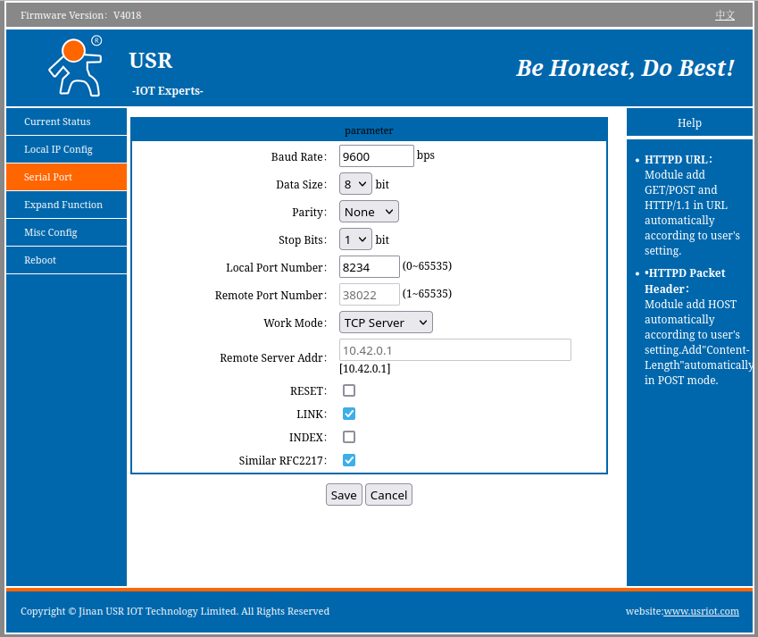
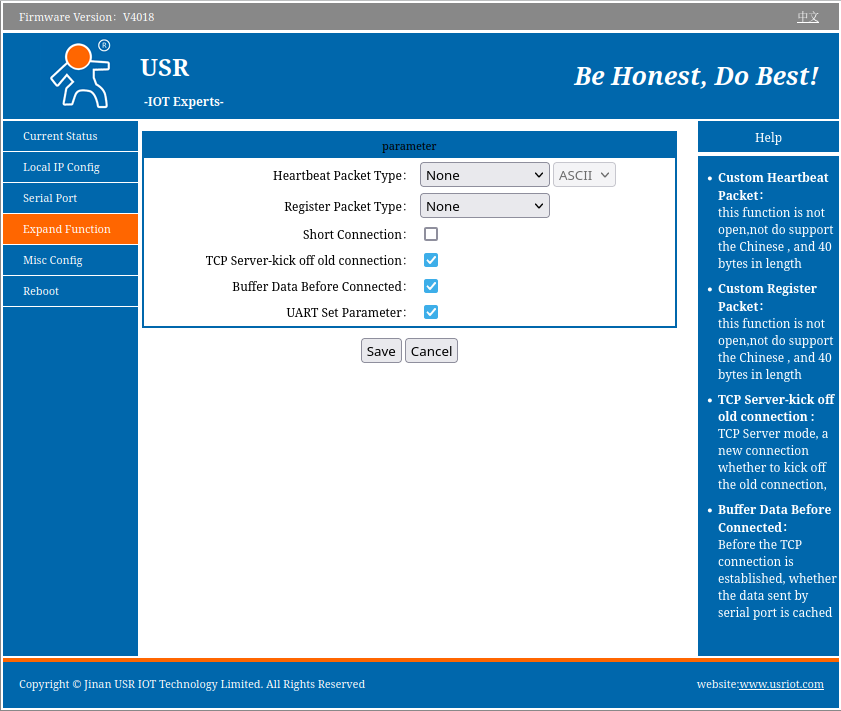

# Adapter configuration for USR-TCP232-304

1. Connect your adapter with a browser. It may be accessible at `http://USR-TCP232-304` (depending on your network configuration). Default user/pass is `admin`/`admin`.
2. "Serial Settings" tab

3. "Expand Function" tab

4. You may also want to set a static IP address in "Local IP Config" tab for your adapter and/or other access settings
in "Misc Config" tab.
5. Reboot